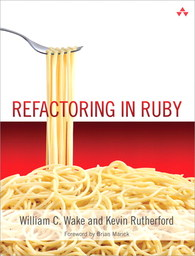

## Testowanie aplikacji w Ruby

**[9.10.2014]**

1. Zaczynamy: [Laptop multitasking hinders classroom learning for both users and nearby peers](http://www.sciencedirect.com/science/article/pii/S0360131512002254?np=y).

----

----

1. Powtórka z języka Ruby.
   - [Learn X in Y minutes][5], where X=Ruby.
   - [Learn X in Ruby], where X=Array,Hash (laboratorium, git)
2. Ogólnie o testowaniu, dostępne narzędzia i technologie: 
   - Edytor i Testowanie
   - [Learn X in Y minutes], where X=Rspec,Capybara,Factory Girl
3. Wprowadzenie do RSpec.
4. Testy jednostkowe.
5. Testy integracyjne.
6. Refaktoryzacja kodu.
7. Pokrycie kodu testami.
   - [simplecov][8]
8. Doubles, mocks i stubs.
9. Praca z *Legacy Code* (zastanym kodem, kodem niepokrytym testami).

### Literatura

1. David Chelimsky, Dave Astels, Zach Dennis, Aslak Hellesøy, Bryan Helmkamp, Dan North.
   [The RSpec Book: Behaviour-Driven Development with RSpec, Cucumber, and Friends][3].
2. [Better Specs](http://betterspecs.org/).
3. Dokumentacja [RSpec](http://rspec.info/):
  - [rspec-core](https://github.com/rspec/rspec-core)
  - [rspec-expectations](https://github.com/rspec/rspec-expectations)
  - [rspec-mocks](https://github.com/rspec/rspec-mocks)
4. Michael Feathers.
   [Working Effectively with Legacy Code](http://www.amazon.com/Working-Effectively-Legacy-Michael-Feathers/dp/0131177052):
  - [CS_CS169.2x Software as a Service, Part 2](https://courses.edx.org/courses/BerkeleyX/CS_CS169.2x/1T2014/courseware/18872bac3b60453bae7c9e00f3660663/)

Język Ruby:

1. [Ruby Tutorial][4].
2. [Ruby Koans](http://rubykoans.com/) – Learn Ruby with the Neo Ruby Koans.
3. Jay Fields, Shane Harvie, Martin Fowler with Kent Beck.
   [Refactoring](http://books.google.pl/books/about/Refactoring.html?id=6jyOUrJBJHAC) – Ruby edition.
4. [Ruby Style Guide](https://github.com/bbatsov/ruby-style-guide) – a community-driven Ruby coding style guide

Agile Project Management tools:

1. [SonicAgile](https://sonicagile.com/)

Różne rzeczy:

* Arne Brasseur.
  [Mutation Testing with Mutant](http://www.sitepoint.com/mutation-testing-mutant/)
* Testing Puzzles:
  [Puzzle Node](http://www.puzzlenode.com/)
* Local Euler:
  [Now with all 476 puzzles and images](http://kmkeen.com/local-euler/)
* Refactoring:
  [Refactoring Notes](http://ghendry.net/refactor.html)

[5]: http://learnxinyminutes.com/docs/ruby/
[1]: https://github.com/elizabrock/NSS-Syllabus-Spring-2013
[2]: http://rvm.io/rvm
[3]: http://pragprog.com/book/achbd/the-rspec-book
[4]: http://www.tutorialspoint.com/ruby/
[6]: http://tryruby.org/levels/1/challenges/0
[7]: https://www.codeschool.com/courses/testing-with-rspec
[8]: https://github.com/colszowka/simplecov
